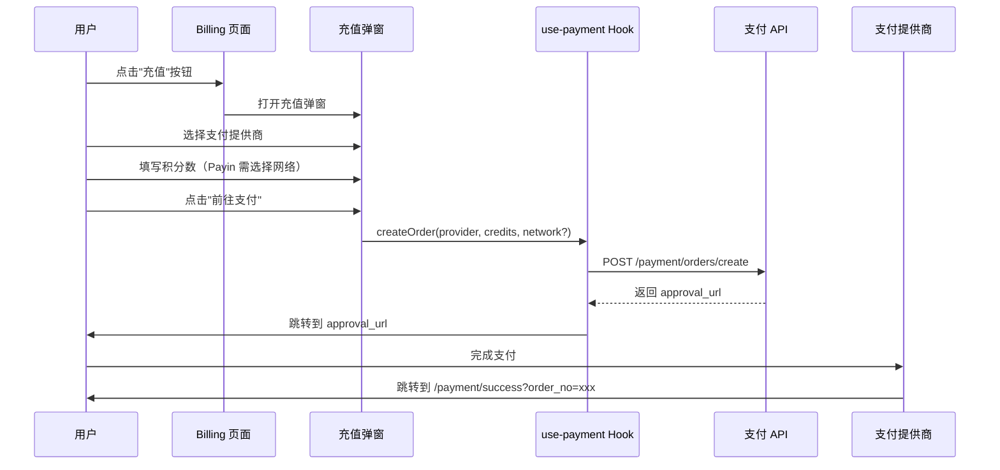

# 支付功能实现总结

## 概述

本文档记录了 JoyfulWords（创作者工具箱）支付功能的完整实现。支付功能支持三种支付提供商（PayPal、Payin、Paydify），提供完整的充值流程和支付结果确认。

**实现日期**: 2025-02-09

**功能状态**: ✅ 已完成

---

## 目录

1. [功能概述](#功能概述)
2. [文件结构](#文件结构)
3. [技术栈](#技术栈)
4. [核心流程](#核心流程)
5. [API 集成](#api-集成)
6. [UI 组件](#ui-组件)
7. [国际化](#国际化)
8. [错误处理](#错误处理)
9. [测试验证](#测试验证)
10. [注意事项](#注意事项)

---

## 功能概述

### 支持的支付提供商

| 提供商 | 描述 | 特殊要求 |
|--------|------|----------|
| **PayPal** | 全球支付平台 | 无 |
| **Payin** | 加密货币支付 | 需选择网络（TRC20/ERC20） |
| **Paydify** | 支付服务提供商 | 无 |

### 核心功能

1. **充值弹窗** - 选择支付提供商，填写积分数
2. **订单创建** - 调用后端 API 创建支付订单
3. **支付跳转** - 跳转到支付提供商页面完成支付
4. **结果确认** - 轮询查询订单状态，确认充值成功
5. **返回刷新** - 返回计费页面，余额自动更新

### 业务规则

- **汇率**: 100 积分 = 1 USD
- **最小充值**: 100 积分
- **最大充值**: 100,000 积分
- **积分数规则**: 必须是 100 的倍数
- **轮询超时**: 最多 15 次（30 秒）

---

## 文件结构

```
lib/
  api/
    payment/
      client.ts           # 支付 API 客户端
      types.ts            # 类型定义
  hooks/
    use-payment.ts        # 支付业务逻辑 Hook
  i18n/
    locales/
      zh.ts              # 中文翻译（已添加 payment 字段）
      en.ts              # 英文翻译（已添加 payment 字段）
  tokens/
    refresh.ts           # Token 刷新（getValidAccessToken）

components/
  billing/
    recharge-dialog.tsx           # 充值弹窗主组件
    payment-provider-selector.tsx # 支付商选择器（Tab）
    payment-form-paypal.tsx       # PayPal 表单
    payment-form-payin.tsx       # Payin 表单（含网络选择）
    payment-form-paydify.tsx      # Paydify 表单
    billing-page.tsx             # Billing 页面（已集成）

app/
  payment/
    success/
      page.tsx           # 支付成功结果页（含轮询逻辑）
    cancel/
      page.tsx           # 支付取消结果页
```

---

## 技术栈

### 前端框架

- **Next.js 16** - App Router
- **TypeScript** - 类型安全
- **React 19** - UI 框架

### UI 组件

- **Shadcn/ui (Radix UI)** - Dialog, Select, Button, Input, Form
- **Lucide React** - 图标库
- **Tailwind CSS** - 样式

### 表单处理

- **React Hook Form** - 表单状态管理
- **Zod** - 表单验证

### 状态管理

- **自定义 Hook** (`use-payment`) - 业务逻辑封装
- **React State** - 组件状态

### API 调用

- **Fetch API** - 原生 HTTP 请求
- **自定义 API Client** - 统一错误处理和认证

### 国际化

- **自定义 i18n 系统** - `useTranslation()` Hook
- **支持语言** - 中文、英文

---

## 核心流程

### 1. 充值流程



### 2. 支付确认流程

```mermaid
sequenceDiagram
    participant P as 支付成功页
    participant H as use-payment Hook
    participant A as 支付 API

    P->>P: 从 URL 获取 order_no
    loop 轮询（最多 15 次）
        P->>H: getOrderStatus(order_no)
        H->>A: GET /payment/orders/:orderNo/status
        A-->>H: 返回订单详情
        H-->>P: 返回订单状态

        alt status === completed
            P->>P: 显示"充值成功"
            停止轮询
        else status === pending || paid
            P->>P: 显示"确认中..."
            等待 2 秒后重试
        else status === failed || cancelled
            P->>P: 显示"支付失败"
            停止轮询
        end
    end

    超时->>P: 显示"确认超时"
```

---

## API 集成

### API 客户端封装

**文件**: `lib/api/payment/client.ts`

```typescript
export const paymentClient = {
  async createOrder(data: CreateOrderRequest) {
    const token = localStorage.getItem('access_token')
    return apiRequest<CreateOrderResponse>('/payment/orders/create', {
      method: 'POST',
      headers: { Authorization: token ? `Bearer ${token}` : '' },
      body: JSON.stringify(data),
    })
  },

  async getOrderDetail(orderNo: string) {
    const token = localStorage.getItem('access_token')
    return apiRequest<OrderDetail>(`/payment/orders/${orderNo}`, {
      headers: { Authorization: token ? `Bearer ${token}` : '' },
    })
  },

  async getOrderStatus(orderNo: string) {
    const token = localStorage.getItem('access_token')
    return apiRequest<OrderStatusResponse>(
      `/payment/orders/${orderNo}/status`,
      {
        headers: { Authorization: token ? `Bearer ${token}` : '' },
      }
    )
  },
}
```

### 认证处理

所有 API 调用使用 `getValidAccessToken()` 确保 token 有效：

```typescript
// lib/hooks/use-payment.ts
const token = await getValidAccessToken()
if (!token) {
  toast({ variant: 'destructive', title: t('payment.error.unauthorized') })
  return null
}
```

**特性**:
- 自动检测 token 过期
- 自动刷新 token
- 刷新失败时清除登录状态

### 错误处理

统一的错误处理模式：

```typescript
const result = await paymentClient.createOrder(request)

if ('error' in result) {
  toast({
    variant: 'destructive',
    title: t('payment.error.createFailed'),
    description: result.error,
  })
  return null
}

return result
```

---

## UI 组件

### 1. 支付商选择器

**文件**: `components/billing/payment-provider-selector.tsx`

**特性**:
- 手动实现的 Tab 切换（参考 billing-page.tsx）
- 显示 PayPal / Payin / Paydify 三个选项
- 使用 lucide-react 图标
- 活跃状态高亮显示

**代码示例**:

```tsx
<div className="flex gap-2 border-b border-border/50">
  {providers.map((provider) => (
    <button
      key={provider}
      onClick={() => onChange(provider)}
      className={isActive ? 'text-primary border-primary' : 'text-muted-foreground'}
    >
      <Icon />
      <span>{t(labelKey)}</span>
    </button>
  ))}
</div>
```

### 2. 支付表单

#### PayPal 表单

**文件**: `components/billing/payment-form-paypal.tsx`

**字段**:
- `credits` (number): 积分数

**验证规则**:
```typescript
z.number()
  .min(100, '最小充值 100 积分')
  .max(100000, '最大充值 100,000 积分')
  .refine((val) => val % 100 === 0, '积分数必须是 100 的倍数')
```

#### Payin 表单

**文件**: `components/billing/payment-form-payin.tsx`

**字段**:
- `credits` (number): 积分数
- `network` (TRC20 | ERC20): 网络类型

**特殊点**:
- 使用 Select 组件选择网络
- 提交时添加 `metadata: { network }`

#### Paydify 表单

**文件**: `components/billing/payment-form-paydify.tsx`

与 PayPal 表单相同，复用验证逻辑。

### 3. 充值弹窗

**文件**: `components/billing/recharge-dialog.tsx`

**状态管理**:
```typescript
const [selectedProvider, setSelectedProvider] = useState<PaymentProvider>('paypal')
const [submitting, setSubmitting] = useState(false)
```

**提交流程**:
1. 用户填写表单
2. 调用 `createOrder(provider, credits, network?)`
3. 获取 `approval_url`
4. 使用 `window.location.href` 跳转到支付页面

**加载状态**:
- 提交时显示 loading spinner
- 禁用表单防止重复提交

---

## 国际化

### 翻译文件

**中文**: `lib/i18n/locales/zh.ts`

```typescript
billing: {
  payment: {
    dialog: { title: "充值积分" },
    providers: {
      paypal: "PayPal",
      payin: "加密货币",
      paydify: "Paydify",
    },
    form: {
      credits: {
        label: "积分数",
        hint: "100 积分 = $1 USD，必须是 100 的倍数",
        // ...
      },
      network: {
        label: "网络类型",
        trc20: "TRC20 (Tron)",
        erc20: "ERC20 (Ethereum)",
      },
      // ...
    },
    // ...
  },
}
```

**英文**: `lib/i18n/locales/en.ts`

对应的英文翻译。

### 使用方式

```tsx
import { useTranslation } from '@/lib/i18n/i18n-context'

const { t } = useTranslation()

<DialogTitle>{t('billing.payment.dialog.title')}</DialogTitle>
```

---

## 错误处理

### 错误类型

| 错误 | 处理方式 |
|------|----------|
| **未授权** (401) | 显示"未授权，请重新登录" |
| **创建订单失败** | Toast 显示错误描述 |
| **查询订单失败** | Toast 显示错误描述 |
| **网络错误** | Toast 显示"未知错误" |
| **支付失败** | 显示失败页面，提供重试按钮 |

### Toast 示例

```typescript
toast({
  variant: 'destructive',
  title: t('payment.error.createFailed'),
  description: result.error,
})
```

---

## 测试验证

### 功能测试清单

#### 1. 充值弹窗
- [ ] 点击"充值"按钮，弹窗正常打开
- [ ] Tab 切换正确，表单正确渲染
- [ ] 弹窗可以正常关闭

#### 2. PayPal 表单
- [ ] 输入积分数，金额预览实时更新
- [ ] 输入小于 100 的值，显示错误
- [ ] 输入大于 100000 的值，显示错误
- [ ] 输入非 100 倍数的值，显示错误
- [ ] 提交时显示 loading 状态

#### 3. Payin 表单
- [ ] 网络选择正常工作
- [ ] 表单验证正确
- [ ] 提交时正确包含 network 参数

#### 4. 支付流程
- [ ] 提交后跳转到 `approval_url`
- [ ] 支付完成后跳转到 `/payment/success?order_no=xxx`
- [ ] 取消支付跳转到 `/payment/cancel`

#### 5. 结果页轮询
- [ ] 成功页显示"确认中..."
- [ ] 轮询 2-3 次后显示"充值成功"
- [ ] 返回按钮跳转到 `/?tab=billing`
- [ ] 余额已更新

#### 6. 国际化
- [ ] 切换到中文，所有文本正确显示
- [ ] 切换到英文，所有文本正确显示

### 手动测试步骤

1. **打开 billing 页面**
2. **点击"充值"按钮**
3. **选择 PayPal**
4. **输入 500 积分**
5. **点击"前往支付"**
6. **在支付页面完成支付（测试环境）**
7. **查看返回的成功页面**
8. **确认轮询成功显示"充值成功"**
9. **点击"返回计费页面"**
10. **确认余额已增加 500 积分**

---

## 注意事项

### 1. Token 管理

**重要**: 所有 API 调用必须使用 `getValidAccessToken()`，确保 token 过期时自动刷新。

```typescript
// ✅ 正确
const token = await getValidAccessToken()
if (!token) {
  // 处理未授权
}

// ❌ 错误
const token = localStorage.getItem('access_token')
// 不会自动刷新
```

### 2. URL 生成

**重要**: `return_url` 和 `cancel_url` 必须使用绝对路径。

```typescript
// ✅ 正确
const baseUrl = typeof window !== 'undefined' ? window.location.origin : ''
return_url: `${baseUrl}/payment/success`

// ❌ 错误
return_url: '/payment/success'
// 可能导致跳转失败
```

### 3. 支付跳转

**重要**: 使用 `window.location.href` 确保完整页面跳转。

```typescript
// ✅ 正确
if (result.approval_url) {
  window.location.href = result.approval_url
}

// ❌ 错误
router.push(result.approval_url)
// 可能导致跨域问题
```

### 4. 轮询超时

**重要**: 必须设置轮询超时，避免无限轮询。

```typescript
const MAX_RETRIES = 15

if (retryCount < MAX_RETRIES - 1) {
  setRetryCount((prev) => prev + 1)
  setTimeout(verifyOrder, 2000)
} else {
  setOrderStatus('timeout')
}
```

### 5. Payin 网络

**重要**: Payin 必须包含 `metadata.network` 参数。

```typescript
const request: CreateOrderRequest = {
  credits,
  provider,
  return_url,
  cancel_url,
  timestamp: Date.now() / 1000,
}

if (provider === 'payin' && network) {
  request.metadata = { network }
}
```

### 6. 表单验证

**重要**: 使用 Zod schema 验证，显示字段级错误。

```typescript
const formSchema = z.object({
  credits: z.number()
    .min(100, 'billing.payment.form.credits.min')
    .max(100000, 'billing.payment.form.credits.max')
    .refine((val) => val % 100 === 0, 'billing.payment.form.credits.multiple'),
})
```

### 7. 加载状态

**重要**: 提交时按钮显示 loading 状态，禁用重复提交。

```tsx
<Button type="submit" disabled={loading}>
  {loading ? (
    <>
      <Loader2Icon className="animate-spin" />
      {t('billing.payment.form.submitting')}
    </>
  ) : (
    t('billing.payment.form.submit')
  )}
</Button>
```

---

## 相关文档

- [支付 API 文档](/docs/api/PAYMENT_API.md)
- [Billing 页面文档](/docs/billing/BILLING_PAGE.md)
- [i18n 国际化文档](/docs/i18n/I18N_GUIDE.md)

---

## 变更记录

| 日期 | 版本 | 变更内容 |
|------|------|----------|
| 2025-02-09 | 1.0.0 | 初始版本，完成支付功能实现 |

---

**文档作者**: Claude Code
**最后更新**: 2025-02-09
